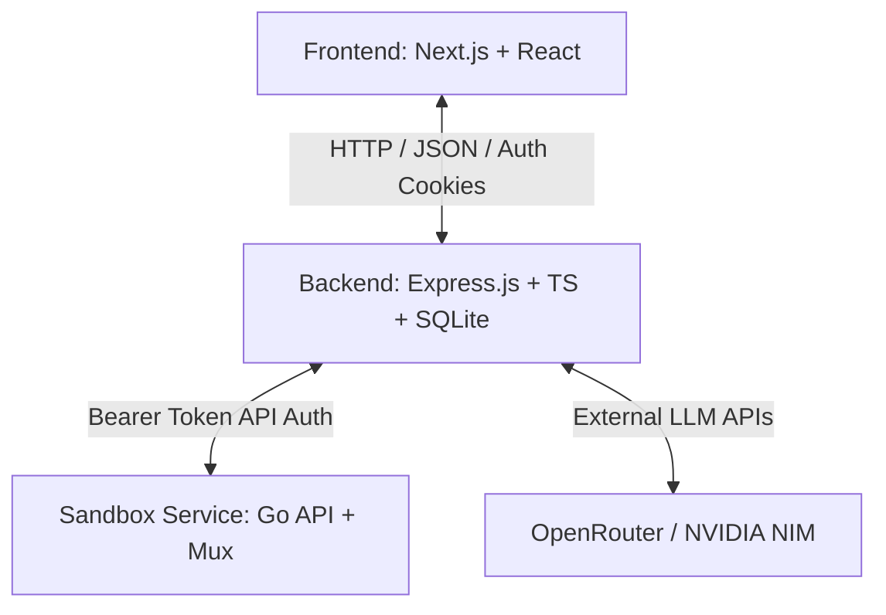

# Velix Platform - Technical Documentation & Changelog

Welcome to **Velix**, a premium web platform designed to facilitate AI-powered code generation, compilation, and sandbox execution for gaming plugins (like Spigot/Minecraft) and other bots.

This document provides a comprehensive overview of the application architecture, the core components, the technology stack, the details of all recent changes, and instructions for running the system locally.

---

## 1. Application Overview

Velix is structured into three main component services:



### Core Components:
1. **Frontend (`/frontend`)**: A modern, high-fidelity user interface built with Next.js (App Router), Tailwind CSS, Lucide Icons, and custom canvas-based elements. It includes pages for the IDE workspace, credit transaction history, pricing tables, public user profiles, and platform settings.
2. **Backend (`/backend`)**: An Express.js REST API server written in TypeScript. It handles user authentication, session management, project workspace configurations, community project indexing, database migrations, and serves as an AI orchestrator (calling OpenRouter & NVIDIA APIs and handling prompt enhancement and web searches).
3. **Sandbox Service (`/sandbox-service`)**: A lightweight compiler and sandbox environment written in Go. It hosts custom plugins, runs test compile builds (e.g. for Java Spigot plugins or Discord scripts), and returns validation outputs.

### Frontend Data Integrations:
* **Supabase Database**: `frontend/src/lib/supabase.ts` provides a small typed REST client for browser-safe Supabase table reads/writes using `NEXT_PUBLIC_SUPABASE_URL` and `NEXT_PUBLIC_SUPABASE_ANON_KEY`.
* **Upstash Redis Cache**: `frontend/src/lib/upstash.ts` is server-side Redis access through Upstash REST. Browser code should use `frontend/src/lib/cache.ts`, which calls the Next route handlers under `/api/cache/:key` so Redis tokens are never exposed to the client.
* **Integration Health**: `GET /api/integrations/health` reports whether Supabase variables are present and whether Upstash responds to `PING`.

---

## 2. Technology Stack

* **Frontend**: Next.js 16 (App Router), React 19, TypeScript, Tailwind CSS, Lucide React, Canvas API, Supabase REST, Upstash Redis REST.
* **Backend**: Node.js, Express.js, TypeScript, SQLite (`better-sqlite3`), JSON Web Tokens (`jsonwebtoken`), `bcryptjs`, Axios, YAML config.
* **Sandbox Service**: Go (Golang), `gorilla/mux` router, `rs/cors` middleware, SQLite (in Go side if needed), YAML configuration.

---

## 3. Database Schema

The SQLite database (`codex.db` located under the backend) has been updated with the following schema to support the credits system, preferences, and activity logging:

### `users` Table
Stores user profile information, auth credentials, remaining credits, preferences, and referral stats.
* `id` (TEXT, Primary Key)
* `email` (TEXT, Unique, Not Null)
* `name` (TEXT, Not Null)
* `password_hash` (TEXT, Not Null)
* `display_name` (TEXT)
* `discord_id` (TEXT)
* `credits` (INTEGER, Default: 100)
* `affiliate_code` (TEXT) - Automatically generated `VEL-XXXXX` referral link
* `profile_id` (INTEGER) - 4-digit code for public profile page lookup
* `history_quick_access` (INTEGER, Default: 0) - Preference switch
* `email_notifications` (INTEGER, Default: 1) - Preference switch
* `paste_as_file` (INTEGER, Default: 1) - Preference switch
* `texture_generation` (INTEGER, Default: 0) - Preference switch
* `knowledge_refractor` (INTEGER, Default: 0) - Preference switch
* `created_at` (DATETIME, Default: CURRENT_TIMESTAMP)

### `credits_transactions` Table
Logs all changes to a user's credit balance (e.g. AI code generation costs, credit purchases).
* `id` (INTEGER, Primary Key, Autoincrement)
* `user_id` (TEXT, Foreign Key)
* `amount` (REAL) - Positive for additions, negative for deductions
* `type` (TEXT) - `generation`, `purchase`, `bonus`
* `description` (TEXT) - Details of the transaction
* `created_at` (DATETIME, Default: CURRENT_TIMESTAMP)

### Other Tables:
* `projects`: Stores user generation projects with their language, model, and public visibility toggle (`is_public`).
* `messages`: Stores chat history under each project.
* `compile_history`: Stores build records, logs, and artifacts paths.
* `plugin_docs`: Curated libraries and mod references synced with GitHub doc files.
* `doc_submissions`: External libraries submitted by users to be ingested into AI context.

---

## 4. Summary of Recent Changes

### A. Credits & Billing System
* **Balance Tracking**: Users start with **100 free credits** upon registration.
* **Deduction Rule**: Code generations `/api/ai/generate` and `/api/ai/generate-and-compile` verify that the user has $\ge 5$ credits and automatically deduct **5 credits** on success, logging a transaction.
* **Insufficient Credits**: Block generation requests and return a `402 Pay Required` error status code.
* **Buy Credits (Mock)**: Endpoint `POST /api/auth/buy-credits` allows mock purchasing credit packages which adds the credits and logs a `purchase` transaction.

### B. User Profiles & System Settings
* **Settings Page**: Added toggle switches to synchronize user preferences with SQLite. Built options for Profile editing (Display name, Discord ID, Email), affiliate referrals, experimental/premium feature toggles, and account deletion.
* **Public Profile Page**: GitHub-style activity calendar overview, list of public projects, download and view counts.
* **Auth Hydration**: Updated `AuthService` and `/me` routes to return the fully hydrated user profile (including preferences and credits balance) rather than only name/email.

### C. Visual Remake & Premium UI Polish
* **Dynamic Matrix Rain**: Canvas-based falling digit/character grid background that matches the screenshot design.
* **Pricing Grid**: Packages ranging from free up to $99.99 with mock purchase hooks.
* **Header Balance Pill**: Display of the remaining credits in the upper-right corner (`🪙 100`).
* **Generation Credit Toasts**: Integration of micro-notifications on generation showing credits used and remaining.
* **Community Page**: Recreated grid of public projects with options to view or fork/clone projects.

### D. Sandbox Hosting & API Security
* **Sandbox Authentication**: Added middleware (`sandbox-service/middleware/auth.go`) verifying `Authorization: Bearer <token>` requests.
* **Bypass logic**: Local developer instances bypass auth if the `SANDBOX_API_KEY` is not set.
* **Backend Integration**: Configured `sandbox_service_url` and `sandbox_api_key` in the backend `config.yml` and `.env` files.
* **Compiler Proxy**: Updated `compiler_routes.ts` proxy to forward authorization headers to the sandbox service securely.
* **Configuration Overrides**: Supported CORS and Port custom overrides via environment variables.

---

## 5. Development Run Instructions

### Prerequisites
1. [Node.js](https://nodejs.org/) installed (v18 or higher recommended).
2. [Go](https://go.dev/) installed (v1.20 or higher recommended).

### Running Sandbox Service
1. Navigate to `sandbox-service/`
2. Create your `.env` file if needed (from `.env.example` template):
   ```env
   SANDBOX_PORT=3002
   SANDBOX_API_KEY=your_secure_api_key_here
   SANDBOX_CORS_ORIGINS=http://localhost:3005,http://localhost:3000
   ```
3. Run:
   ```bash
   # Using local Go command (if in PATH)
   go run main.go
   
   # Or using absolute path if Go is in C:\Program Files\Go
   & "C:\Program Files\Go\bin\go.exe" run main.go
   ```

### Running Backend API Server
1. Navigate to `backend/`
2. Ensure dependencies are installed: `npm install`
3. Configure your variables in `.env`:
   ```env
   PORT=3005
   OPENROUTER_API_KEY=your_openrouter_api_key
   SANDBOX_SERVICE_URL=http://localhost:3002
   SANDBOX_API_KEY=your_secure_api_key_here
   ```
4. Run:
   ```bash
   npm run dev
   ```

### Running Frontend Interface
1. Navigate to `frontend/`
2. Ensure dependencies are installed: `npm install`
3. Run:
   ```bash
   npm run dev
   ```
   *The frontend is served locally at `http://localhost:3000` (or the next available port).*

4. Optional Supabase and Upstash configuration:
   ```env
   NEXT_PUBLIC_SUPABASE_URL=https://your-project.supabase.co
   NEXT_PUBLIC_SUPABASE_ANON_KEY=your_supabase_anon_key
   UPSTASH_REDIS_REST_URL=https://your-redis.upstash.io
   UPSTASH_REDIS_REST_TOKEN=your_upstash_redis_rest_token
   ```
   Copy `frontend/.env.example` when setting up a fresh local environment. Keep the Upstash token server-side; do not prefix it with `NEXT_PUBLIC_`.


old ai saved chat
read info.md and add / use superbase for database and upstash for redis on frontend and other thing


8:35 AM


I’ll read info.md first and map the project shape, then I’ll wire in Supabase and Upstash in the smallest way that fits the existing frontend. “superbase” sounds like Supabase; I’ll treat it that way unless the repo points somewhere else.


info.md confirms the app currently uses SQLite in the backend and a Next.js frontend. I’m checking the frontend API layer and package setup now so the Supabase/Upstash addition lands where the app already expects integrations to live.


The frontend currently has no Supabase or Upstash dependencies, and all data calls go through the existing Express API. I’m going to add lightweight frontend integration modules plus Next route handlers for Redis so secrets stay server-side; direct browser Redis tokens would be a bad leak.


I’ve got the shape now: Next App Router can host server-only API route handlers, so the browser can call /api/cache/... while Upstash credentials remain in environment variables. I’m adding Supabase as a browser/server client pair and Redis as a server-only helper with tiny health/cache endpoints.

8:35 AM


resume and dont break anything


8:36 AM


Worked for 3m 44s


Implemented additively, without replacing the existing backend/SQLite flow.
Added:
Supabase REST client: [supabase.ts (line 1)](C:/Users/Administrator/Desktop/Codex Remake/frontend/src/lib/supabase.ts:1)
Server-side Upstash Redis helper: [upstash.ts (line 1)](C:/Users/Administrator/Desktop/Codex Remake/frontend/src/lib/upstash.ts:1)
Browser-safe cache API wrapper: [cache.ts (line 1)](C:/Users/Administrator/Desktop/Codex Remake/frontend/src/lib/cache.ts:1)
Next cache routes: [route.ts (line 1)](C:/Users/Administrator/Desktop/Codex Remake/frontend/src/app/api/cache/[...key]/route.ts:1)
Integration health route: [route.ts (line 1)](C:/Users/Administrator/Desktop/Codex Remake/frontend/src/app/api/integrations/health/route.ts:1)
Env template: [.env.example (line 1)](C:/Users/Administrator/Desktop/Codex Remake/frontend/.env.example:1)
Docs updated in [info.md (line 25)](C:/Users/Administrator/Desktop/Codex Remake/info.md:25)
I also wired Upstash into the community page as a short-lived optional cache. If Upstash is missing or down, it falls back to the existing backend behavior.
Verification:
npx tsc --noEmit passes.
npm run lint is blocked by an existing ESLint config/package issue: eslint/config is not exported by the installed ESLint package.

info.mdDocument · MDOpen previewOpen in

Edited 8 files+283-12Review changesUndoReview

frontend/.env.example+9-0
frontend/src/app/api/cache/[...key]/route.ts+55-0
frontend/src/app/api/integrations/health/route.ts+23-0
Show 5 more files


8:40 AM


i want it to fully use superbase for database and auth and use upstash for redis and add feild to add in env and make all section of this app secure and its api and token etc


8:43 AM


I’ll move this from “optional frontend integration” to a real platform migration path: Supabase for auth/database, Upstash for Redis, and stricter API/token handling. I’m going to inspect backend services/routes first so I don’t yank out SQLite blindly and break flows that depend on current schema.


The backend is tightly coupled to DatabaseService, which is good news: most of the database migration can happen behind that service boundary. Auth is currently local bcrypt + JWT, so I’ll replace that path with Supabase Auth while preserving the route response shapes the frontend expects.


A few security gaps are obvious already: cookies are readable by JS, several file endpoints are unauthenticated, admin routes only use a shared password and no session guard, and config logs can leak settings. I’ll add shared auth/security middleware first, then wire routes through it instead of repeating token parsing everywhere.


Because Supabase operations are network calls, the old synchronous SQLite methods need to become async at the route boundary. I’ll keep method names stable where possible, but route calls will move to await, which is the least invasive way to make the database genuinely remote.


I’m going to use Supabase’s REST/Auth APIs directly instead of adding SDK packages, because this workspace’s package setup is fragile and the native HTTP path is enough. That means no new dependency risk, and all service-role/database access stays in the backend only.


Created 2 files


Supabase DB/Auth service code is now in place. Next I’m adding middleware for authenticated users/admins and cookie settings, then I’ll apply it across routes so API access is not piecemeal.


Created a file


For the main server, I’m tightening defaults without adding dependencies: env-driven CORS, JSON body limit, basic security headers, no full config dumps in logs, and no framework fingerprint header.


Edited a file


Edited 4 files+565-22Review changesUndoReview

backend/services/DatabaseService.ts+342-0
backend/services/AuthService.ts+117-0
backend/middleware/auth.ts+77-0
Show 1 more file


favicon.ico

rename app to Velix and use this logo and favicon


8:48 AM


I’ll switch to the branding task now and keep it scoped: replace visible app names/metadata and copy the provided logo/favicon into the frontend assets. I’ll scan for current brand strings first so I don’t accidentally rename code identifiers that should stay stable.


The current visible brand is mostly Cryon, with some older Kodari/Codex docs and backend labels. I’ll copy the assets into the frontend, then swap the header/logo spots to use the new image instead of just text.


I’ll add a tiny reusable BrandMark component so the same Velix logo treatment appears consistently in the sidebar and top nav. Then I’ll replace the copied text labels on the main, IDE, pricing, and credits screens.


The assets are copied: frontend/public/logo.png and the app favicon has been replaced. Now I’m patching the UI text and logo slots.


Created a file


I’m replacing the main app chrome with BrandMark now. I’ll keep the name replacement textual where it’s just labels or copy, and use the image component in nav/sidebar spots.


Edited 6 files


Main navigation is patched. I’m doing a second pass for remaining visible brand text, including admin/settings copy and backend labels.


There are still a few old brand mentions in settings/admin/docs and backend metadata. I’m renaming those to Velix too, including referral code prefixes from KOD to VEL.


Edited 9 files


Visible UI is now Velix. I’m doing one more search for stale brand strings; internal AI request titles can safely become Velix too, but I’ll leave third-party/repo names alone where they refer to an actual documentation source.


Edited 2 files


No stale Cryon/Kodari/Codex Remake strings remain in the app/backend search set, and the frontend TypeScript check passes. I’m going to run a quick backend TypeScript check too because the backend was already being touched in the previous request.


The frontend branding check passed, but the backend TypeScript check exposed the in-progress Supabase migration from the previous request: routes still treated database/auth calls as synchronous. I’m going to finish that cleanup now rather than leave the backend in a half-migrated state.


Edited 2 files


Edited 20 files+187-261Review changesUndoReview

frontend/src/components/BrandMark.tsx+26-0
frontend/src/app/credits/page.tsx+1-1
frontend/src/app/ide/[id]/page.tsx+10-9
Show 17 more files